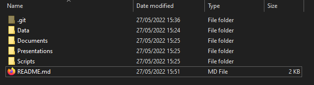
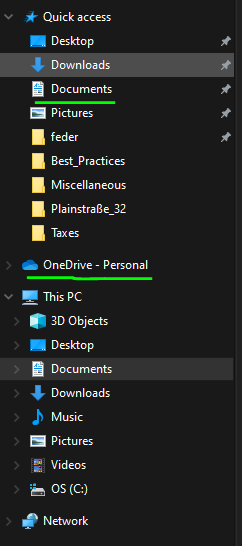
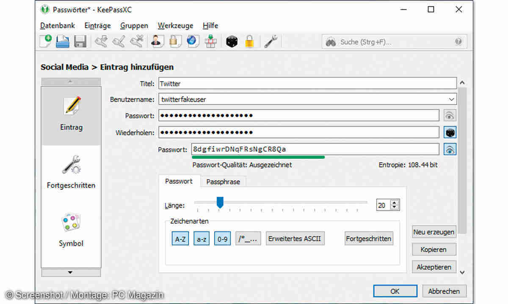

# Best Practices
This document describes a series of good practices to keep your personal computer organized
and well structured in order to simplify your daily tasks.

## Naming Conventions
- All folder names start with capital letters and spaces are replaced by underscores: `Folder_Name`
- All files are camel case: `file_name.xyz`
- All date are in the `YYYYMMDD` format

If you pick a language stick to it if possible.

## Folder structure
The following folders should be present within the folder:
- Data
- Scripts
- Presentations
- Documents
- Images
- Videos

A README.md file to describe the content of the main folder and a .git folder to track its evolution
should be present.

## Where to store the folders
All new folders/projects should be stored under the default Documents folder usually present both
in Microsoft and Linux.

If you trust cloud servers like One Cloud or Google Drive you could store all your files there
and therefore have them available at all time and avoid duplicates and sending them via email. 

## What goes on the Desktop
The desktop contains only links to software and applications. No folders or files should be stored
there.

## How to handle passwords
Take advantage of passwords management systems (ex: KeyPassXC) to store passwords and make sure to change
them regularly (ex: once every 3 months).

Store the keypass file somewhere you do not lose it and name it in an unconventional way so it is hard to understand what it is about.

## Pictures
The Pictures folder is divided by years, months and activity:
- 2022
	- 09
		- My_Activity
		
## Downloads
It should not contain any relevant file or information. Once you download something place it to
where it should belong to. In my case I just keep all the executable files which I download
when I want to install a new software.

## Back Up
If you followed the steps above, you can just copy the content of your main Documents
folder, Pictures and Videos to your portable hard drive. That should be all.